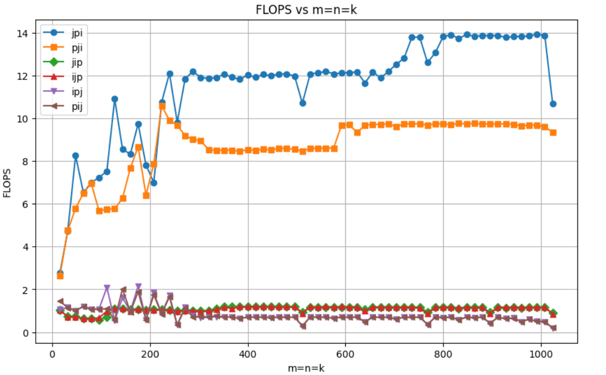
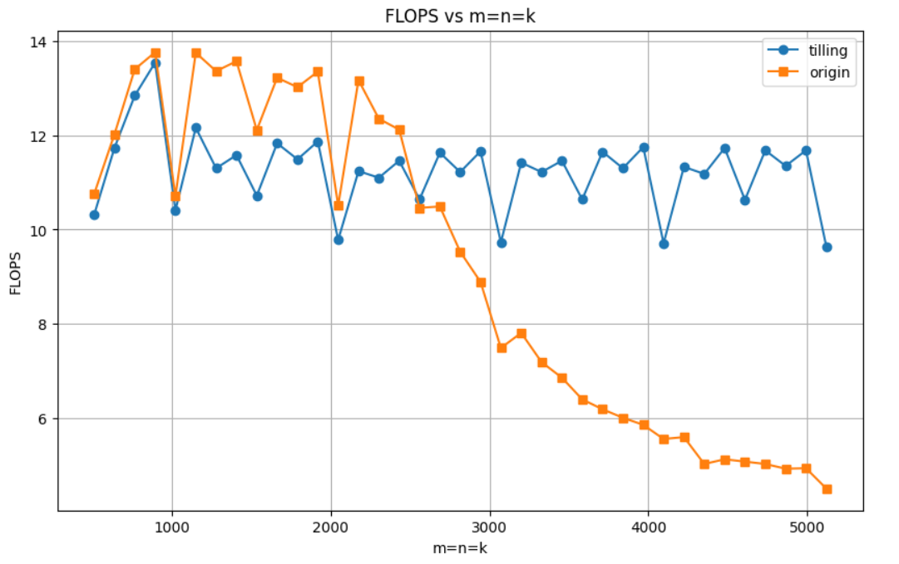
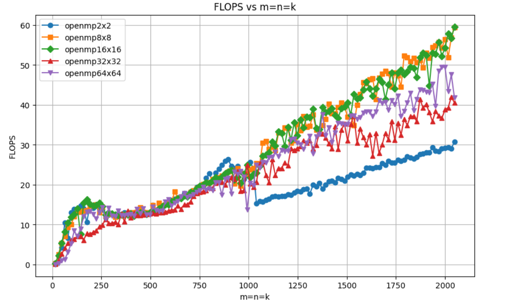

### CPU矩阵乘法优化实践与实验分析

**矩阵乘法的优化方法**

1. **循环交换**
2. **loop tilling**
3. **data packing**
4. **loop unrolling**
5. **OpenMP并行执行循环体**
6. **使用向量化指令（汇编代码编写kernel）**

本项目旨在通过利用上述提到的方法逐步优化CPU上的矩阵乘法，提高其性能。同时，项目也是作者初次学习CPU矩阵乘法优化的实践，并包含了学习过程中的总结和思考。过程中难免存在不足或错误之处，欢迎批评指正。


#### 使用方法

以step0的算法为例：

```bash
cd step0

# 编译，默认是intel平台，gcc编译
# 如果需要编译riscv平台，需要修改Makefile，将Makefile的前几行中 CROSS_COMPILE 配置为正确的交叉编译器
make

# 测试
bash run_bl_sgemm.sh
```


#### step0 矩阵循环交换实验

循环交换即交换嵌套循序，循环交换的主要目的是：对于多维数组中的元素应该尽量能顺序访问。这样可以改善内存访问的空间局部性，对缓存更加友好，这种转换有助于消除内存带宽和内存时延瓶颈。

**实验矩阵乘法的源代码如下所示**

```c++
// 注意这里是列主序的数据存放方式
for ( j = 0; j < n; j ++ ) {            // Start 2-nd loop
  for ( p = 0; p < k; p ++ ) {          // Start 1-st loop
      for ( i = 0; i < m; i ++ ) {      // Start 0-th loop
          C( i, j ) += A( i, p ) * B( p, j );
      }                                 // End   0-th loop
  }                                     // End   1-st loop
}                                        // End   2-nd loop
```

**实验结果分析**

<center class="half">
    
    
</center>


不同循环执行顺序的性能情况如上图所示，从图中可以看出：

1. 为什么当`i`作为最内层循环时有着最好的性能

  出现这种情况的原因是：`i` 作为内层循环时更符合数据局部性，可以利用 `prefetch` ，减少 `cache miss` 的情况。而其他情况则会出现跨行去访问数据。这样，就无法通过 `prefetch` 去降低 `cache miss` 的情况 ，从而导致大量访问主存的情况，导致效率下降

2. 为什么 `jpi`  的性能比 `pji` 的性能更高

  这是因为`pji` 对于矩阵 `B` 的访问是跨行访问的，导致无法利用 `prefecth` 去减少 `cache miss` 的情况。

3. 为什么随着数据规模的增大整体性能在逐渐下降

  当 `A、B `矩阵大小小于 `L2 cache` 时，`gemm` 仅需要从内存中读取 `A、B` 矩阵大小的数据；但是当 `A、B` 矩阵大小大于 `L2 cache` 时，`gemm` 从内存中读取的数据大小则会超过 `A、B `矩阵的大小，造成 `cache miss` 的增加，导致性能恶化。

总结：嵌套循环的执行顺序应该尽可能符合局部性原理（即尽量避免出现跨行读取数据的情况）

#### step1 基本分块

解决 `step0` 中第三点问题，一个解决思路是：将大矩阵拆分为小矩阵，这样小矩阵就可以完全的放到 `cache` 中。

**基本分块**

基本分块思想：先将矩阵验证 `m,n` 维度切分，`k` 维度不进行切分。切分过程如下图所示：

1. `A` 矩阵沿着 `m` 维度切分，每个小矩阵大小为 `(MR,k)`
2. `B` 矩阵沿着 `n` 维度切分，每个小矩阵大小为 `(k,NR)`
3. 小矩阵 `(MR,k)` 和小矩阵 `(k,NR)` 相乘得到 `C` 中的小矩阵 `(MR,NR)` 

基本分块代码如下

```c++
// 这里计算小矩阵 (MR,NR) 中每个元素的乘法
void AddDot( int k, float *A, int lda, float *B, int ldb, float *result ) {
  int p;
  for ( p = 0; p < k; p++ ) {
    *result += A( 0, p ) * B( p, 0 );
  }
}

// 这里计算 C 中小矩阵 (MR,NR) 的乘法
void AddDot_MRxNR( int k, float *A, int lda, float *B, int ldb, float *C, int ldc )
{
  int ir, jr;
  int p;
  for ( jr = 0; jr < DGEMM_NR; jr++ ) {
    for ( ir = 0; ir < DGEMM_MR; ir++ ) {
      AddDot( k, &A( ir, 0 ), lda, &B( 0, jr ), ldb, &C( ir, jr ) );
    }
  }
}

void bl_sgemm(
    int    m,
    int    n,
    int    k,
    float *A,
    int    lda,
    float *B,
    int    ldb,
    float *C,        // must be aligned
    int    ldc        // ldc must also be aligned
)
{
    int    i, j, p;
    int    ir, jr;

    // Early return if possible
    if ( m == 0 || n == 0 || k == 0 ) {
        printf( "bl_sgemm(): early return\n" );
        return;
    }
	// 这里进行矩阵的切分
    for ( j = 0; j < n; j += DGEMM_NR ) {          // Start 2-nd loop
        for ( i = 0; i < m; i += DGEMM_MR ) {      // Start 1-st loop
            AddDot_MRxNR( k, &A( i, 0 ), lda, &B( 0, j ), ldb, &C( i, j ), ldc );
        }                                          // End   1-st loop
    }                                              // End   2-nd loop

}
```

**实验结果分析**

<center class="half">
    
    
</center>

不同的 `MR,NR` 下性能如上图所示：

1. 为什么修改 `MR,NR` 的大小对程序的性能没有提升

   这是因为：基本分块虽然降低了 `cache miss` 的情况，但是也导致循环层增加了。

   ```tex
   对于 jip 循环，各矩阵的 cache miss 情况分析。假设 A(m,k) B(k,n), cache_line=b:
   
   origin:
   A = k/b * m * n
   B = k/b * n
   C = m/b * n
   
   使用 MR,NR 大小对矩阵 A,B 进行分块:
   A = k/b * MR * m/MR * n/NR = k/b * m * n/NR
   B = k/b * NR * n/NR = k/b * n
   C = MR/b * NR * m/MR * n/NR = m/b * n
   
   从上述 cache miss 的计算可以看出使用基础分块后是能减少一定的 cache miss 情况
   ```

2. 为什么优化后的代码性能提升了这么多

   优化后的代码主要使用了两个优化点：

   1. **循环展开（是优化的重点）**
   2. 寄存器缓存（寄存器结果重复利用）

   

   优化后的代码如下：

   ```c++
   void AddDot_2x2( int k, float *A, int lda, float *B, int ldb, float *C, int ldc )
   {
      register float C00 = 0.0f, C01= 0.0f, C10= 0.0f, C11 = 0.0f;// 寄存器重复利用
      int p;
      for (p = 0; p < k; p++) { // 循环展开，相当于同时做MR和NR层循环
        C00 += A(0, p) * B(p, 0); 
        C01 += A(0, p) * B(p, 1);
        C10 += A(1, p) * B(p, 0);
        C11 += A(1, p) * B(p, 1);
      }
      C(0, 0) += C00;
      C(0, 1) += C01;
      C(1, 0) += C10;
      C(1, 1) += C11;
   }
   
   void bl_sgemm(
       int    m,
       int    n,
       int    k,
       float *A,
       int    lda,
       float *B,
       int    ldb,
       float *C,        // must be aligned
       int    ldc        // ldc must also be aligned
   )
   {
       int    i, j, p;
       int    ir, jr;
   
       // Early return if possible
       if ( m == 0 || n == 0 || k == 0 ) {
           printf( "bl_sgemm(): early return\n" );
           return;
       }
   
       for ( j = 0; j < n; j += 2 ) {          // Start 2-nd loop
           for ( i = 0; i < m; i += 2 ) {      // Start 1-st loop
              AddDot_2x2( k, &A( i, 0 ), lda, &B( 0, j ), ldb, &C( i, j ), ldc );
           }                                   // End   1-st loop
       }                                       // End   2-nd loop
   }
   ```

3. 为什么随着数据规模增大，性能上还是下降了

   当矩阵规模较少（`k`较小）时，`unrolling` 版本比原始版本有所提升，但是当矩阵超过一定规模后，性能避免不了的还是下降了，这是因为当`k`比较大时，矩阵分成的小矩阵在`cache`里放不下了，所以需要更优的分块方式。

#### step2 cache 级别分块

`step2` 相较于 `step1` 的区别是：在 `k` 维度上也进行了分块，实现了更细粒度的分块，这样能确保每个小矩阵都能尽可能的放在 `cache` 中（即分块的目的是保证分块后计算所用到的所有数据，在执行计算时也依然存在于 `cache` 中）

**分块代码**

**注意：MC * KC  小于L2的1/2**

```c++
inline void packA_mcxkc(
        int    m,
        int    k,
        float *XA,
        int    ldXA,
        float *packA
        )
{
    int    i, p;

    for ( p = 0; p < k; p ++ ) {
        for ( i = 0; i < m; i ++ ) {
            *packA ++ = *(XA + p * ldXA + i);
        }
    }
}

/*
 * --------------------------------------------------------------------------
 */

inline void packB_kcxnc(
        int    n,
        int    k,
        float *XB,
        int    ldXB,
        float *packB
        )
{
    int    j, p;

    for ( j = 0; j < n; j ++ ) {
        for ( p = 0; p < k; p ++ ) {
            *packB ++ = *(XB + j * ldXB + p);
        }
    }
}

/*
 * --------------------------------------------------------------------------
 */
void bl_macro_kernel(
        int    m,
        int    n,
        int    k,
        float *packA,
        float *packB,
        float *C,
        int    ldc
        )
{
    int    i, p, j;


    for ( j = 0; j < n; j ++ ) {            // Start 2-nd loop
      for ( p = 0; p < k; p ++ ) {          // Start 1-st loop
          float elem_B = packB[ j * k + p ];
          float *p_elemA = &(packA[ p * m]);
          float *p_elemC = &(C[ j * ldc]);
          for ( i = 0; i < m; i ++ ) {      // Start 0-th loop
              *p_elemC++ += *p_elemA++ * elem_B;
          }                                 // End   0-th loop
      }                                     // End   1-st loop
  }
                                           // 2-th loop around micro-kernel
}

// C must be aligned
void bl_sgemm(
        int    m,
        int    n,
        int    k,
        float *XA,
        int    lda,
        float *XB,
        int    ldb,
        float *C,        // must be aligned
        int    ldc        // ldc must also be aligned
        )
{
    int    i, j, p;
    int    ic, ib, jc, jb, pc, pb;
    int    ir, jr;
    float *packA, *packB;
    char   *str;

    // Early return if possible
    if ( m == 0 || n == 0 || k == 0 ) {
        printf( "bl_sgemm(): early return\n" );
        return;
    }

    // Allocate packing buffers
    packA  = bl_malloc_aligned( DGEMM_KC, ( DGEMM_MC + 1 ), sizeof(float) );
    packB  = bl_malloc_aligned( DGEMM_KC, ( DGEMM_NC + 1 ), sizeof(float) );

    for ( jc = 0; jc < n; jc += DGEMM_NC ) {                                 // 5-th loop around micro-kernel
        jb = min( n - jc, DGEMM_NC );
        for ( pc = 0; pc < k; pc += pb ) {                                   // 4-th loop around micro-kernel
            pb = min( k - pc, DGEMM_KC );

            packB_kcxnc(													// 数据重排，保证更好的 prefetch
                    jb,
                    pb,
                    &XB[ jc * ldb +  pc],
                    ldb,
                    packB
                    );

            for ( ic = 0; ic < m; ic += ib ) {                               // 3-rd loop around micro-kernel

                ib = min( m - ic, DGEMM_MC );

                packA_mcxkc(												// 数据重排，保证更好的 prefetch
                        ib,
                        pb,
                        &XA[ pc * lda + ic],
                        lda,
                        packA
                        );
                bl_macro_kernel(
                        ib,
                        jb,
                        pb,
                        packA,
                        packB,
                        &C[ jc * ldc + ic ], 
                        ldc
                        );
            }                                                                     // End 3.rd loop around micro-kernel
        }                                                                         // End 4.th loop around micro-kernel
    }                                                                             // End 5.th loop around micro-kernel

    free( packA );
    free( packB );
}
```

**实验结果分析**

<center class="half">
    
    
</center>

- 从第一张图中可以看出，使用 `packing(数据重组)` 时能够进一步提升性能，这是因为使用数据存储后，小矩阵计算中对数据的访问更符合局部性，从而降低了 `cache miss` 的情况。
- 从第二张图中可以看出，使用 `tiling` 可以有效的缓解数据规模增大时性能下降的问题。这是因为数据规模增大后将矩阵切分，每次加载数据时只加载部分数据，从而缓解了加载全部数据时频繁的`cache miss` 情况，故性能能够保持稳定
- 从第一张图中可以看出，在使用了 `tilling 和 packing` 的基础上在使用 `unrolling` 将会提升性能。


此外，从上图就能看出来，`tilling` 中分块大小的选取也会一定程度上影响程序性能：

- **分块过小时**

  *频繁的循环控制*：小块意味着内外层循环次数增加，导致循环控制语句（如循环变量增量、条件检查等）执行频率增加。这些控制语句虽然单次开销不大，但大量累积后会增加整体计算时间。

  *缓存行利用不充分*：缓存以缓存行（通常为64字节）为单位加载数据。如果块太小，可能无法充分利用缓存行中的所有数据，导致**部分缓存行的数据未被使用**。

  **频繁的数据数据重新加载（块与块数据的频繁交换）**

  - 当分块大小过小时，循环中的计算会频繁在不同块之间切换。这种频繁切换意味着每次处理的块中包含的数据在缓存中停留的时间较短，且可能在下一次需要访问时已被其他数据替换。
  - 小块的频繁切换导致刚加载到缓存中的数据还没来得及被多次使用，就被后续的块数据替换掉了。这破坏了时间局部性，因为缓存中的数据在很短的时间内就被淘汰，无法被再次利用。
  - 由于频繁切换块，每次新的块需要访问的内存数据很可能不在缓存中，从而导致缓存失效。这种频繁的缓存失效意味着程序需要不断地从主存中加载数据，增加了内存访问延迟。

  **内存访问开销**：每次小块访问内存都有固定的访问延迟。频繁的小块访问累积后总的**内存访问时间增加，导致整体计算效率下降（即计算时间无法覆盖读取数据的时间）**。

- **分块过大时**

  **频繁的数据数据重新加载（块内数据的频繁交换）**:由于块过大，计算一个块时会需要不断从内存中加载数据，从而导致大量的缓存替换操作。每次替换操作都可能导致缓存中已有的数据被驱逐，这增加了缓存失效的频率和内存访问的开销。


#### step3 OpenMP实现循环并行化

`OpenMP` 相当于**把循环的每一次迭代分配到多个线程取中去执行，即从串行变成并行执行。**

**源代码**

```c++
#include <stdio.h>

#include "bl_sgemm.h"
#include "bl_config.h"
#include "omp.h"
inline void packA_mcxkc(
        int    m,
        int    k,
        float *XA,
        int    ldXA,
        float *packA,
        int ldPackA,
        int offset
        )
{
    int    i, p;

    for ( p = 0; p < k; p ++ ) {
        for ( i = 0; i < m; i ++ ) {
            *(packA + p * ldPackA + offset + i) = *(XA + p * ldXA + i);
        }
    }
}

inline void packA_mcxkc_origin(
        int    m,
        int    k,
        float *XA,
        int    ldXA,
        float *packA
        )
{
    int    i, p;

    for ( p = 0; p < k; p ++ ) {
        for ( i = 0; i < m; i ++ ) {
            *packA ++ = *(XA + p * ldXA + i);
        }
    }
}

/*
 * --------------------------------------------------------------------------
 */

inline void packB_kcxnc(
        int    n,
        int    k,
        float *XB,
        int    ldXB,
        float *packB
        )
{
    int    j, p;

    for ( j = 0; j < n; j ++ ) {
        for ( p = 0; p < k; p ++ ) {
            *packB ++ = *(XB + j * ldXB + p);
        }
    }
}

/*
 * --------------------------------------------------------------------------
 */
void bl_macro_kernel(
        int    m,
        int    n,
        int    k,
        float *packA,
        float *packB,
        float *C,
        int    ldc
        )
{
    int    i, p, j;


    for ( j = 0; j < n; j ++ ) {            // Start 2-nd loop
      for ( p = 0; p < k; p ++ ) {          // Start 1-st loop
          float elem_B = packB[ j * k + p ];
          float *p_elemA = &(packA[ p * m]);
          float *p_elemC = &(C[ j * ldc]);
          for ( i = 0; i < m; i ++ ) {      // Start 0-th loop
              *p_elemC++ += *p_elemA++ * elem_B;
          }                                 // End   0-th loop
      }                                     // End   1-st loop
  }
                                           // 2-th loop around micro-kernel
}

// C must be aligned
void bl_sgemm(
        int    m,
        int    n,
        int    k,
        float *XA,
        int    lda,
        float *XB,
        int    ldb,
        float *C,        // must be aligned
        int    ldc        // ldc must also be aligned
        )
{
    int    i, j, p;
    int    ic, ib, jc, jb, pc, pb;
    int    ir, jr;
    float *packA, *packB, *packA_origin;
    char   *str;
    int mp_num_threads = 16;

    // Early return if possible
    if ( m == 0 || n == 0 || k == 0 ) {
        printf( "bl_sgemm(): early return\n" );
        return;
    }

    // Allocate packing buffers
    packA  = bl_malloc_aligned( DGEMM_KC, ( DGEMM_MC + 1 ) * mp_num_threads, sizeof(float) );
    packB  = bl_malloc_aligned( DGEMM_KC, ( DGEMM_NC + 1 ), sizeof(float) );
    // packA_origin = bl_malloc_aligned( DGEMM_KC, ( DGEMM_MC + 1 ), sizeof(float) );
    
    
    for ( jc = 0; jc < n; jc += DGEMM_NC ) {                                 // 5-th loop around micro-kernel
        jb = min( n - jc, DGEMM_NC );
        for ( pc = 0; pc < k; pc += pb ) {                                   // 4-th loop around micro-kernel
            pb = min( k - pc, DGEMM_KC );
            #pragma omp parallel for num_threads(mp_num_threads)
            for(j = 0; j < jb; j += DGEMM_NR){ // j 作为循环索引, OpenMP会自动将其设为线程私有变量
                 packB_kcxnc(
                    min(jb - j, DGEMM_NR),
                    pb,
                    &XB[ (jc + j) * ldb +  pc],
                    ldb,
                    &packB[ j * pb]
                    );
            }
           
            #pragma omp parallel for num_threads(mp_num_threads) private(ib)
            for ( ic = 0; ic < m; ic += DGEMM_MC ) {                               // 3-rd loop around micro-kernel
                ib = min( m - ic, DGEMM_MC );
                int tid = omp_get_thread_num();
                packA_mcxkc_origin(
                        ib,
                        pb,
                        &XA[ pc * lda + ic],
                        lda,
                        &packA[tid * DGEMM_MC * DGEMM_KC]
                        );
                // #pragma omp parallel for num_threads(mp_num_threads)
                // for(i = 0; i < ib; i += DGEMM_MR){
                //     packA_mcxkc(
                //         min(ib - i,DGEMM_MR),
                //         pb,
                //         &XA[ pc * lda + ic + i],
                //         lda,
                //         packA,
                //         ib,
                //         i
                //         );
                // }
                
                
                bl_macro_kernel(
                        ib,
                        jb,
                        pb,
                        &packA[tid * DGEMM_MC * DGEMM_KC],
                        packB,
                        &C[ jc * ldc + ic ], 
                        ldc
                        );
            }                                                                     // End 3.rd loop around micro-kernel
        }                                                                         // End 4.th loop around micro-kernel
    }                                                                             // End 5.th loop around micro-kernel

    free( packA );
    free( packB );
}
```

**实验结果分析**

<center class="half">
    
    
    
    
</center>

- 第三，四张图所示：给 `pack` 部分使用循环并行并不能提升性能，但是在计算部分使用循环并行可以提升性能（有待考究，可能是实实验方法不对）

- 第一张图所示：使用 `OpenMP` 普遍可以提高性能，但是线程的选取要根据实际情况来，过大过小都会影响性能

  当线程数量过多时，每个线程都需要访问数据，从而增大了访存带宽的压力，从而导致性能的下降

  当线程数量过少时，无法充分发挥并行的优势

- 第二张图所示：数据规模越大 `OpenMP` 循环并行化的效果越好

  数据规模越大越能充分利用计算资源，从而提升性能

#### step4 kernel使用SIMD指令优化

**使用SIMD（AVX2）指令优化的源代码**

```c++
#include <stdio.h>

#include "bl_sgemm.h"
#include "bl_config.h"
#include "omp.h"
#define __AXV2
inline void packA_mcxkc(
        int    m,
        int    k,
        float *XA,
        int    ldXA,
        float *packA,
        int ldPackA,
        int offset
        )
{
    int    i, p;

    for ( p = 0; p < k; p ++ ) {
        for ( i = 0; i < m; i ++ ) {
            *(packA + p * ldPackA + offset + i) = *(XA + p * ldXA + i);
        }
    }
}

inline void packA_mcxkc_origin(
        int    m,
        int    k,
        float *XA,
        int    ldXA,
        float *packA
        )
{
    int    i, p;

    for ( p = 0; p < k; p ++ ) {
        for ( i = 0; i < m; i ++ ) {
            *packA ++ = *(XA + p * ldXA + i);
        }
    }
}

/*
 * --------------------------------------------------------------------------
 */

inline void packB_kcxnc(
        int    n,
        int    k,
        float *XB,
        int    ldXB,
        float *packB
        )
{
    int    j, p;

    for ( j = 0; j < n; j ++ ) {
        for ( p = 0; p < k; p ++ ) {
            *packB ++ = *(XB + j * ldXB + p);
        }
    }
}


#if(defined(__AVX2))
#include <immintrin.h> // AVX2 header
int sgemm_mat_opt_macc_avx(int bm, int bn, int bk, float* ba, float* bb, float* c, int ldc)
{
    float *pInA = ba;              // Input data matrix pointer A
    float *pInB = bb;              // Input data matrix pointer B
    float *px = c;                // Temporary output data matrix pointer
    int ii, jj, kk;

    __m256 va0m8, vres0m8, vres1m8, vres2m8, vres3m8; // 定义256位的向量寄存器
    
    // 使用循环展开，展开大小为4
    for (jj = bn / 4; jj > 0; jj--) {
        px = c;
        pInA = ba;

        // 主循环：处理对齐的8个浮点数块
        for (ii = bm / 8 * 8; ii > 0; ii -= 8) {
            pInB = bb;

            vres0m8 = _mm256_set1_ps(0.0f);
            vres1m8 = _mm256_set1_ps(0.0f);
            vres2m8 = _mm256_set1_ps(0.0f);
            vres3m8 = _mm256_set1_ps(0.0f);

            for (kk = bk; kk > 0; kk--) {
                va0m8 = _mm256_loadu_ps(pInA);  // 对齐加载

                // 这里的四条指令，数量上与上述的 bn/4 中的 4 是对应的，即使用4条指令进行循环展开处理
                vres0m8 = _mm256_fmadd_ps(_mm256_set1_ps(*(pInB + 0)), va0m8, vres0m8); 
                vres1m8 = _mm256_fmadd_ps(_mm256_set1_ps(*(pInB + bk)), va0m8, vres1m8);
                vres2m8 = _mm256_fmadd_ps(_mm256_set1_ps(*(pInB + 2 * bk)), va0m8, vres2m8);
                vres3m8 = _mm256_fmadd_ps(_mm256_set1_ps(*(pInB + 3 * bk)), va0m8, vres3m8);
                pInA += bm;
                pInB += 1;
            }

            __m256 tmp = _mm256_loadu_ps(px);
            tmp = _mm256_add_ps(tmp, vres0m8);
            _mm256_storeu_ps(px, tmp);

            tmp = _mm256_loadu_ps(px + ldc);
            tmp = _mm256_add_ps(tmp, vres1m8);
            _mm256_storeu_ps(px + ldc, tmp);

            tmp = _mm256_loadu_ps(px + 2 * ldc);
            tmp = _mm256_add_ps(tmp, vres2m8);
            _mm256_storeu_ps(px + 2 * ldc, tmp);

            tmp = _mm256_loadu_ps(px + 3 * ldc);
            tmp = _mm256_add_ps(tmp, vres3m8);
            _mm256_storeu_ps(px + 3 * ldc, tmp);

            px += 8;
            // pInA = ba + bm - ii + 8;     // 这种写法是错误的，没考虑到在处理对齐数据块时数据量的变化
            pInA = ba + (bm/8*8) - ii + 8; // 主循环总共的数据量为 bm/8*8
        }

        // 处理剩余不足8个浮点数的数据
        int remainder = bm % 8;
        if (remainder > 0) {
            __m256i mask = _mm256_set_epi32(
                remainder > 7 ? -1 : 0,
                remainder > 6 ? -1 : 0,
                remainder > 5 ? -1 : 0,
                remainder > 4 ? -1 : 0,
                remainder > 3 ? -1 : 0,
                remainder > 2 ? -1 : 0,
                remainder > 1 ? -1 : 0,
                remainder > 0 ? -1 : 0
            );

            pInA = ba + bm - remainder;
            pInB = bb;

            vres0m8 = _mm256_set1_ps(0.0f);
            vres1m8 = _mm256_set1_ps(0.0f);
            vres2m8 = _mm256_set1_ps(0.0f);
            vres3m8 = _mm256_set1_ps(0.0f);

            for (kk = bk; kk > 0; kk--) {
                va0m8 = _mm256_maskload_ps(pInA, mask);

                vres0m8 = _mm256_fmadd_ps(_mm256_set1_ps(*(pInB + 0)), va0m8, vres0m8);
                vres1m8 = _mm256_fmadd_ps(_mm256_set1_ps(*(pInB + bk)), va0m8, vres1m8);
                vres2m8 = _mm256_fmadd_ps(_mm256_set1_ps(*(pInB + 2 * bk)), va0m8, vres2m8);
                vres3m8 = _mm256_fmadd_ps(_mm256_set1_ps(*(pInB + 3 * bk)), va0m8, vres3m8);
                pInA += bm;
                pInB += 1;
            }

            __m256 tmp = _mm256_maskload_ps(px, mask);
            tmp = _mm256_add_ps(tmp, vres0m8);
            _mm256_maskstore_ps(px, mask, tmp);

            tmp = _mm256_maskload_ps(px + ldc, mask);
            tmp = _mm256_add_ps(tmp, vres1m8);
            _mm256_maskstore_ps(px + ldc, mask, tmp);

            tmp = _mm256_maskload_ps(px + 2 * ldc, mask);
            tmp = _mm256_add_ps(tmp, vres2m8);
            _mm256_maskstore_ps(px + 2 * ldc, mask, tmp);

            tmp = _mm256_maskload_ps(px + 3 * ldc, mask);
            tmp = _mm256_add_ps(tmp, vres3m8);
            _mm256_maskstore_ps(px + 3 * ldc, mask, tmp);
        }

        bb += (bk << 2);
        c += (ldc << 2);
    }


    // 处理上述大小为4的循环展开剩余的尾部数据（可能的值为（0，1，2，3），这里处理的是行数>=2的情况
    bn = bn & 3;// 此时的尾部数据可能存在 0，1，2，3
    for (jj = bn / 2; jj > 0; jj--) {
        px = c;
        pInA = ba;

        // 主循环：处理对齐的8个浮点数块
        for (ii = bm / 8 * 8; ii > 0; ii -= 8) {
            pInB = bb;

            vres0m8 = _mm256_set1_ps(0.0f);
            vres1m8 = _mm256_set1_ps(0.0f);

            for (kk = bk; kk > 0; kk--) {
                va0m8 = _mm256_loadu_ps(pInA);  // 对齐加载

                vres0m8 = _mm256_fmadd_ps(_mm256_set1_ps(*(pInB + 0)), va0m8, vres0m8);
                vres1m8 = _mm256_fmadd_ps(_mm256_set1_ps(*(pInB + bk)), va0m8, vres1m8);
                pInA += bm;
                pInB += 1;
            }

            __m256 tmp = _mm256_loadu_ps(px);
            tmp = _mm256_add_ps(tmp, vres0m8);
            _mm256_storeu_ps(px, tmp);

            tmp = _mm256_loadu_ps(px + ldc);
            tmp = _mm256_add_ps(tmp, vres1m8);
            _mm256_storeu_ps(px + ldc, tmp);

            px += 8;
            pInA = ba + (bm/8*8) - ii + 8; // 移动到下8个A数据
        }

         // 处理剩余不足8个浮点数的数据
        int remainder = bm % 8;
        if (remainder > 0) {
            __m256i mask = _mm256_set_epi32(
                remainder > 7 ? -1 : 0,
                remainder > 6 ? -1 : 0,
                remainder > 5 ? -1 : 0,
                remainder > 4 ? -1 : 0,
                remainder > 3 ? -1 : 0,
                remainder > 2 ? -1 : 0,
                remainder > 1 ? -1 : 0,
                remainder > 0 ? -1 : 0
            );

            pInA = ba + bm - remainder;
            pInB = bb;

            vres0m8 = _mm256_set1_ps(0.0f);
            vres1m8 = _mm256_set1_ps(0.0f);

            for (kk = bk; kk > 0; kk--) {
                va0m8 = _mm256_maskload_ps(pInA, mask);

                vres0m8 = _mm256_fmadd_ps(_mm256_set1_ps(*(pInB + 0)), va0m8, vres0m8);
                vres1m8 = _mm256_fmadd_ps(_mm256_set1_ps(*(pInB + bk)), va0m8, vres1m8);
                pInA += bm;
                pInB += 1;
            }

            __m256 tmp = _mm256_maskload_ps(px, mask);
            tmp = _mm256_add_ps(tmp, vres0m8);
            _mm256_maskstore_ps(px, mask, tmp);

            tmp = _mm256_maskload_ps(px + ldc, mask);
            tmp = _mm256_add_ps(tmp, vres1m8);
            _mm256_maskstore_ps(px + ldc, mask, tmp);
        }

        bb += (bk << 1);
        c += (ldc << 1);
    }

    // 处理上述大小为2的循环展开剩余的尾部数据（可能的值为（0，1），这里处理的是行数为1的情况
    bn = bn & 1;// 此时的尾部数据还有可能是0，1
    for (jj = bn; jj > 0; jj--) {
        px = c;
        pInA = ba;

        // 主循环：处理对齐的8个浮点数块
        for (ii = bm / 8 * 8; ii > 0; ii -= 8) {
            pInB = bb;

            vres0m8 = _mm256_set1_ps(0.0f);

            for (kk = bk; kk > 0; kk--) {
                va0m8 = _mm256_loadu_ps(pInA);  // 对齐加载

                vres0m8 = _mm256_fmadd_ps(_mm256_set1_ps(*(pInB + 0)), va0m8, vres0m8);
                pInA += bm;
                pInB += 1;
            }

            __m256 tmp = _mm256_loadu_ps(px);
            tmp = _mm256_add_ps(tmp, vres0m8);
            _mm256_storeu_ps(px, tmp);

            px += 8;
             pInA = ba + (bm/8*8) - ii + 8; // 移动到下8个A数据
        }

         // 处理剩余不足8个浮点数的数据
        int remainder = bm % 8;
        if (remainder > 0) {
            __m256i mask = _mm256_set_epi32(
                remainder > 7 ? -1 : 0,
                remainder > 6 ? -1 : 0,
                remainder > 5 ? -1 : 0,
                remainder > 4 ? -1 : 0,
                remainder > 3 ? -1 : 0,
                remainder > 2 ? -1 : 0,
                remainder > 1 ? -1 : 0,
                remainder > 0 ? -1 : 0
            );

            pInA = ba + bm - remainder;
            pInB = bb;

            vres0m8 = _mm256_set1_ps(0.0f);

            for (kk = bk; kk > 0; kk--) {
                va0m8 = _mm256_maskload_ps(pInA, mask);

                vres0m8 = _mm256_fmadd_ps(_mm256_set1_ps(*(pInB + 0)), va0m8, vres0m8);
                pInA += bm;
                pInB += 1;
            }

            __m256 tmp = _mm256_maskload_ps(px, mask);
            tmp = _mm256_add_ps(tmp, vres0m8);
            _mm256_maskstore_ps(px, mask, tmp);

        }

        
        bb += bk;
        c += ldc;
    }
    return 0;
}
#endif


/*
 * --------------------------------------------------------------------------
 */
void bl_macro_kernel(
        int    m,
        int    n,
        int    k,
        float *packA,
        float *packB,
        float *C,
        int    ldc
        )
{
#if (defined(__defualt))
    int    i, p, j;

    for ( j = 0; j < n; j ++ ) {            // Start 2-nd loop
      for ( p = 0; p < k; p ++ ) {          // Start 1-st loop
          float elem_B = packB[ j * k + p ];
          float *p_elemA = &(packA[ p * m]);
          float *p_elemC = &(C[ j * ldc]);
          for ( i = 0; i < m; i ++ ) {      // Start 0-th loop
              *p_elemC++ += *p_elemA++ * elem_B;
          }                                 // End   0-th loop
      }                                     // End   1-st loop
  }
                                           // 2-th loop around micro-kernel
#elif (defined(__AVX2))
    sgemm_mat_opt_macc_avx(m, n, k, packA, packB, C, ldc);
#endif  
}

// C must be aligned
void bl_sgemm(
        int    m,
        int    n,
        int    k,
        float *XA,
        int    lda,
        float *XB,
        int    ldb,
        float *C,        // must be aligned
        int    ldc        // ldc must also be aligned
        )
{
    int    i, j, p;
    int    ic, ib, jc, jb, pc, pb;
    int    ir, jr;
    float *packA, *packB, *packA_origin;
    char   *str;
    int mp_num_threads = 8;

    // Early return if possible
    if ( m == 0 || n == 0 || k == 0 ) {
        printf( "bl_sgemm(): early return\n" );
        return;
    }

    // Allocate packing buffers
    packA  = bl_malloc_aligned( DGEMM_KC, ( DGEMM_MC + 1 ) * mp_num_threads, sizeof(float) );
    packB  = bl_malloc_aligned( DGEMM_KC, ( DGEMM_NC + 1 ), sizeof(float) );
    // packA_origin = bl_malloc_aligned( DGEMM_KC, ( DGEMM_MC + 1 ), sizeof(float) );
    
    
    for ( jc = 0; jc < n; jc += DGEMM_NC ) {                                 // 5-th loop around micro-kernel
        jb = min( n - jc, DGEMM_NC );
        for ( pc = 0; pc < k; pc += pb ) {                                   // 4-th loop around micro-kernel
            pb = min( k - pc, DGEMM_KC );
            #pragma omp parallel for num_threads(mp_num_threads)
            for(j = 0; j < jb; j += DGEMM_NR){
                 packB_kcxnc(
                    min(jb - j, DGEMM_NR),
                    pb,
                    &XB[ (jc + j) * ldb +  pc],
                    ldb,
                    &packB[ j * pb]
                    );
            }
            
            // packB_kcxnc(
            //         jb,
            //         pb,
            //         &XB[ jc * ldb +  pc],
            //         ldb,
            //         packB
            //         );
           
            #pragma omp parallel for num_threads(mp_num_threads)
            for ( ic = 0; ic < m; ic += DGEMM_MC ) {                               // 3-rd loop around micro-kernel
                ib = min( m - ic, DGEMM_MC );
                int tid = omp_get_thread_num();
                packA_mcxkc_origin(
                        ib,
                        pb,
                        &XA[ pc * lda + ic],
                        lda,
                        &packA[tid * DGEMM_MC * DGEMM_KC]
                        );
                // #pragma omp parallel for num_threads(mp_num_threads)
                // for(i = 0; i < ib; i += DGEMM_MR){
                //     packA_mcxkc(
                //         min(ib - i,DGEMM_MR),
                //         pb,
                //         &XA[ pc * lda + ic + i],
                //         lda,
                //         packA,
                //         ib,
                //         i
                //         );
                // }
                
                bl_macro_kernel(
                        ib,
                        jb,
                        pb,
                        &packA[tid * DGEMM_MC * DGEMM_KC],
                        packB,
                        &C[ jc * ldc + ic ], 
                        ldc
                        );
            }                                                                     // End 3.rd loop around micro-kernel
        }                                                                         // End 4.th loop around micro-kernel
    }                                                                             // End 5.th loop around micro-kernel

    free( packA );
    free( packB );
}
```

**实验结果分析**

<center class="half">
    
    
</center>

从上述的图片中不难看出，使用了`SIMD`指令对计算逻辑进行重写后，性能都有不小的提升，可能的原因分析如下：

1. **并行处理**

   SIMD指令集通过允许**一条指令同时处理多个数据元素**，利用了数据级并行性。例如：我们需要对两个包含四个浮点数的数组进行元素加法。普通的标量处理需要执行四次加法，而使用SIMD指令可以一次性完成这四次加法，从而提高处理效率。

2. **减少循环开销**

   在标量编程中，处理大量数据通常需要通过循环来逐个处理每个数据元素。循环控制本身（如计数器更新、条件判断）会带来额外的计算开销。通过使用SIMD指令，可以减少循环次数，从而降低这些开销。例如：一个数组有1000个元素，使用标量处理需要1000次迭代，而如果一个SIMD寄存器可以容纳8个元素，那么只需要125次迭代即可完成相同的任务，这大大减少了循环控制的开销。

3. **提高内存带宽利用率**

   SIMD指令通常支持**同时加载和存储多个数据元素**，这样可以更**有效地利用内存带宽**。内存带宽是指在给定时间内可以从内存中读取或写入的数据量。通过减少内存访问次数和同时处理多个数据元素，SIMD指令可以降低内存访问的延迟对性能的影响。

**此外需要注意的是**：

- 在使用`SIMD`指令编程时应该时刻小心尾部数据（**不足一条`SIMD`指令所需的数据量**）的处理。

- 在`AVX2`中向量寄存器存储内存数据是**从右往左**存入向量寄存器的，所以在**设置掩码的时候需要特别小心一些**

  ```c++
  int arr[8] = {1, 2, 3, 4, 5, 6, 7, 8};
  __m256i ymm = _mm256_loadu_si256((__m256i*)arr);// ymm寄存器: [ 8, 7, 6, 5, 4, 3, 2, 1 ]
  
  // 访问向量寄存器的数据时会屏蔽这种差异
  int element0 = _mm256_extract_epi32(ymm, 0); // 结果是 1
  int element1 = _mm256_extract_epi32(ymm, 7); // 结果是 8
  
  // 设置掩码时需要注意，例如要取 arr 中的前四个数据,应该是如下的写法
  __m256i mask = _mm256_setr_epi32(0, 0, 0, 0, -1, -1, -1, -1);
  // __m256i mask = _mm256_setr_epi32(-1, -1, -1, -1, 0, 0, 0, 0); 这种写法就是错误的了
  ```

- 使用**循环展开时也需要特别注意尾部循环迭代的处理（循环展开后的迭代次数不是循环总次数的整数倍时）**


#### 致谢
本项目的开发基于以下两个项目进行修改和实验，在此向这些项目的贡献者表示衷心的感谢：

[BLISlab: A Sandbox for Optimizing GEMM](https://github.com/flame/blislab)

[riscv平台优化矩阵乘(基于blislab优化实践)](https://github.com/surez-ok/blislab_riscv/tree/master)

感谢他们为优化矩阵乘法算法所做出的贡献。

此外，还要特别感谢[@RussWong](https://github.com/RussWong)在本项目过程中给予的答疑解惑与帮助。
